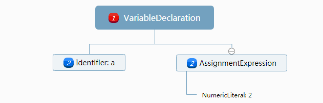

什么是作用域？

作用域是一套规则，它规定了如何储存和访问变量。

### 编译原理

代码在执行前会经过编译，编译一般有三个步骤：

- 分析、词法分析（Tokenizing/Lexing）

  将由字符组成的字符串分解成代码块（即词法单元）

  ```js
  var a = 2; // 会分解成 var、 a、 =、 2、 ;等词法单元
  ```

- 解析/语法分析（Parsing）

  将词法单元流转化成一个由元素逐级嵌套所组成的代表了程序语法结构的树（抽象语法树（Abstract Syntax Tree,AST））	

  

- 代码生成

  将`AST`转化为可执行代码。即将`var a = 2;`的`AST`转化为一组机器指令，用来创建一个叫做`a`的变量（包括分配内存等），并将一个值存储在`a`中。

[点击此处](http://naotu.baidu.com/file/caef6abc74930a1d90d29b82ecb18784)百度脑图

### 理解作用域

对`var a = 2;`而言，编译器将程序分解为词法单元，而后将之解析成树结构，在进行生产代码阶段：

`var  a = 2;`被分解成两步`var a ` 和`a = 2`

1. 编译首先询问作用域是否有变量`a`存在于作用域集合中，若有则继续编译，若无则在作用域中新建一个变量`a`
2. 接下来编译器生成运行时代码，处理`a=2;`。引擎同样会先询问作用域是否存在一个变量为`a`，若有则使用，若无则上上一级作用域查找。最终在查询不到的情况下抛出错误。

#### `LHS`和`RHS`(有点懵)

存在于上面编译器的第二步中，即引擎查找变量的方式。”赋值操作的目标是谁“则`LHS`查询，“谁是赋值操作的源头“则`RHS`查询。

**`RHS`是输出某个变量的值，`LHS`是查找到赋值的对象进行赋值操作，即存储值的容器。**

分区二者是因为其对错误处理不同，当作用域查找不到相关变量时，`RHS`会抛出`ReferenceError`，`LHS`则会隐式创建一个全局变量（非严格模式下)


